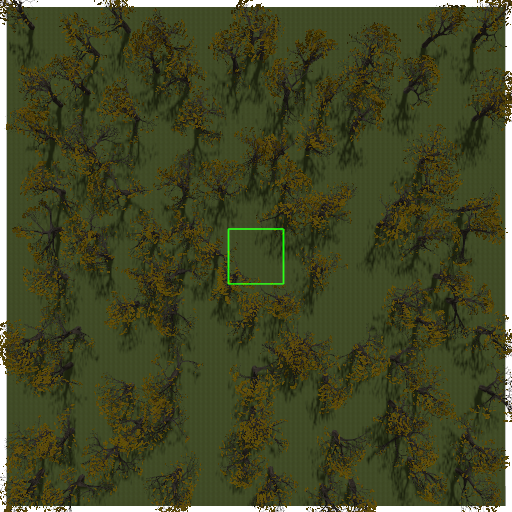

# Installation

## Apptainer

1. Clone the simulator without the submodules that contain the gazebo source code.
    ```
    git clone https://github.com/bostelma/gazebo_sim.git
    ```

2. [Install Apptainer](https://github.com/apptainer/apptainer/blob/main/INSTALL.md) using the official instructions.

3. Build the Apptainer image from the definition file. There are two versions, one without python bindings, called `ubuntu-gazebo_sim-basic.def` and one with python bindings, called `ubuntu-gazebo_sim-full.def`. The latter uses a python 3.7.9 conda environment, while the first one uses the default python 3.10 interpreter of ubuntu. As the images are read-only, the path to the mutable files on the host system has to be passed to the build command.
    ```
    cd ~/gazebo_sim/apptainer
    apptainer build --build-arg GZ_PATH=~/gazebo_sim gazebo_sim-full.sif ubuntu-gazebo_sim-full.def
    ```

4. Build the plugins using the provided script `build_plugins_basic.sh` or `build_plugins_full.sh`, depending on whether you have the basic or full version:
    ```
    apptainer shell gazebo_sim-full.sif
    cd ../plugins
    sh build_plugins_full.sh
    exit
    ```

## Source Install 

### Ubuntu 22.04

1. Update Ubuntu to make all packages available:
    ```
    sudo apt-get update
    sudo apt-get upgrade
    ```

2. Clone the simulator, which already contains the official Gazebo source code via git submodules, into the home directory:
    ```
    cd
    git clone --recurse-submodules https://github.com/bostelma/gazebo_sim.git
    ```

3. Start with the official [Gazebo Garden Installation on Ubuntu](https://gazebosim.org/docs/garden/install_ubuntu_src) to install the tools and dependencies. Getting the sources is not required and stop before the build process.


4. Install additional dependencies:

    ```
    sudo apt install libopencv-dev python3-opencv
	pip install dict2xml
    ```

5. Install an updated version of protoc:
    ```
    sudo apt autoremove protobuf-compiler libprotobuf-dev libprotobuf-lite23
	mkdir proto_ws && cd proto_ws
	git clone https://github.com/google/protobuf.git
	cd protobuf
	git checkout tags/v21.5
	git submodule init
	git submodule update
	mkdir build && cd build
	cmake .. -DCMAKE_CXX_FLAGS="-fPIC"
	make -j4
	sudo make install
    ```

6. Limit the number of cores for building to avoid crashes due to not enough memory:
    ```
    export MAKEFLAGS="-j4"
    ```

7. Build Gazebo itself using colcon:
    ```
    cd ~/gazebo_sim/workspace
    colcon build --symlink-install --merge-install --cmake-args -DBUILD_TESTING=OFF -DCMAKE_BUILD_TYPE=RelWithDebInfo --packages-ignore gz-python --executor sequential
    ```

8. Source the Gazebo workspace to make it available in the current prompt:
    ```
    . ~/gazebo_sim/workspace/install/setup.bash
    ```

9. Build the basic plugins: Forest, Person, and Photo Shoot individually as seen below, or by executing the script `build_plugins_basic.sh` in the plugins directory.
    ```
    cd ~/gazebo_sim/plugins/forest  # change to 'person' and 'photo_shoot' respectively
	mkdir build
	cd build
	cmake .. -DCMAKE_INSTALL_PREFIX=~/gazebo_sim/plugins/install
	make
    make install
    ```

10. Setup all paths to make everything available in the current prompt:
    ```
	export GZ_SIM_RESOURCE_PATH=$GZ_SIM_RESOURCE_PATH:~/gazebo_sim/models
	export GZ_SIM_SYSTEM_PLUGIN_PATH=$GZ_SIM_SYSTEM_PLUGIN_PATH:~/gazebo_sim/plugins/install/lib
	export PYTHONPATH=${PYTHONPATH}:~/gazebo_sim/python
	export PYTHONPATH=${PYTHONPATH}:~/gazebo_sim/workspace/install/lib/python
    ```

### Windows

1. Install/Activate [WSL2](https://learn.microsoft.com/de-de/windows/wsl/install) and setup a Ubuntu 22.04 environment.

2. Follow steps 1 to 5 of the ubuntu install instructions above.

3. Install a specific OGRE2 version that contains a WSL specific bug fix:
    ```
    sudo apt remove libogre-next-2.3.0 libogre-next-2.3-dev
	curl -o libogre-next-2.3_2.3.1-4osrf~jammy_amd64.deb https://build.osrfoundation.org/job/ogre-2.3-debbuilder/54/artifact/pkgs/libogre-next-2.3.0_2.3.1-4osrf%7Ejammy_amd64.deb
	curl -o libogre-next-2.3-dev_2.3.1-4osrf~jammy_amd64.deb https://build.osrfoundation.org/job/ogre-2.3-debbuilder/54/artifact/pkgs/libogre-next-2.3-dev_2.3.1-4osrf%7Ejammy_amd64.deb
	sudo apt install ./libogre-next-2.3_2.3.1-4osrf~jammy_amd64.deb
	sudo apt install ./libogre-next-2.3-dev_2.3.1-4osrf~jammy_amd64.deb
	cd /usr/include
	sudo cp -r OGRE-2.3/ OGRE_TMP/
	sudo mv OGRE_TMP OGRE-2.3/OGRE
    ```

4. Finish the same way as in the ubuntu install instructions above.

5. Allows access to the /dev/dri directory in case the error occurs:
    ```
    sudo chmod ugo+rwx dev/dri/*
    ```

### Full installation with python bindings

This component adds python binding to msgs and transport and is required to use the swarm functionality.

1. Update Ubuntu to make all packages available:
    ```
    sudo apt-get update
    sudo apt-get upgrade
    ```

2. Setup a python 3.7 environment, for example using conda and install protobuf==3.20.3, opencv=4.5.5.64, libstdcxx-ng, and conda-build
    ```
    cd
    wget https://repo.anaconda.com/miniconda/Miniconda3-latest-Linux-x86_64.sh
    bash Miniconda3-latest-Linux-x86_64.sh
    ```
    Restart the shell by closing and reopening it.
    ```
    conda create -n gz-ws python=3.7.9
    conda activate gz-ws
    conda install protobuf=3.20.3
    conda install conda-build libstdcxx-ng
    pip install opencv==4.5.5.64
    ```

3. Follow steps 2 through 5 of the ubuntu install instructions and install the correct libogre version if you are using windows.

4. Export your selected python interpreter (`which python` shows path):
    ```
    export PROTOCOL_BUFFERS_PYTHON_IMPLEMENTATION=[your python path]
    ```

5. Modify the sdformat13 CMakeLists.txt to fix a bug: Replace `find_package(Python3 ${GZ_PYTHON_VERSION} REQUIRED COMPONENTS Development)` with `find_package(Python3 ${GZ_PYTHON_VERSION} REQUIRED COMPONENTS Interpreter Development)` in `~/gazebo_sim/workspace/src/sdformat/CMakeLists.txt`, line 148.
   

6. Add your python path and version to the build command:
    ```
    cd ~/gazebo_sim/workspace
    export MAKEFLAGS="-j4"
    colcon build --symlink-install --merge-install --cmake-args -DBUILD_TESTING=OFF -DCMAKE_BUILD_TYPE=RelWithDebInfo -DPython3_EXECUTABLE=[path to your python] -DGZ_PYTHON_VERSION=3.7 --packages-ignore gz-python --executor sequential
    ```

7. Source the Gazebo workspace to make it available in the current prompt:
    ```
    . ~/gazebo_sim/workspace/install/setup.bash
    ```

8. Prepare gz-python build from workspace directory and make sure that it finds your chosen python interpreter!
    ```
    mkdir -p ~/gazebo_sim/workspace/src/gz-python/build
    cd src/gz-python/build
    cmake ..
    ```

9. In _deps/pybind11_protobuf-src/CMakeLists.txt, replace `SHARED` with `STATIC`

10. Build gz-python using `make`

11. Build the plugins as in step 8 of the ubuntu install instructions, but this time build the swarm plugin as well. Note, that you need to call `build_plugins_full.sh` this time to compile the swarm plugin as well.

12. Setup all paths to make everything available in the current prompt. If you don't use conda, replace the conda develop command with a respective export command like in step 10 of the ubuntu install instructions.
    ```
	export GZ_SIM_RESOURCE_PATH=$GZ_SIM_RESOURCE_PATH:~/gazebo_sim/models
	export GZ_SIM_SYSTEM_PLUGIN_PATH=$GZ_SIM_SYSTEM_PLUGIN_PATH:~/gazebo_sim/plugins/install/lib
	conda develop ~/gazebo_sim/python
    conda develop ~/gazebo_sim/workspace/install/lib/python
    conda develop ~/gazebo_sim/workspace/src/gz-python/build/python
    ```

## Usage

### Apptainer

The general idea is that you work on the project files on the host system while using the environment that contains gazebo via apptainer.

1. Start an named instance of your created image.
    ```
    apptainer instance start ~/gazebo_sim/apptainer/gazebo_sim-full.sif gazebo
    ```

2. Start a shell within the container.
    ```
    apptainer shell instance://gazebo
    ```

3. Stop an instance once you are finished.
    ```
    apptainer instance stop gazebo
    ```

To be able to work on notebooks while using the container environment, the container feature a jupyter server that is running when starting an instance as described above. To get the address and the required token, execute `jupyter notebook list` from within the container. If you want to use an password instead, you need to add it to the build command: `--build-arg JUPYTER_PASSWORD=my_secure_password`. Make sure to use a secure password as it prevents others from executing code on your machine!

### Photo Shoot

1. Make sure that everything is available by performing step 7 and 10 of the ubuntu install instructions before starting.

2. Create the data directory for the example script:
    ```
    mkdir -p ~/data/photo_shoot
    ```

3. Generate an example image:
    ```
    cd ~/gazebo_sim/python
    python3 example_photo_shoot.py
    ```

4. The resulting image is now stored at the previously created directory. Have a look at the used python file to generate custom images yourself.

### Swarm

1. Make sure that everything is available by performing step 7 and 10 of the ubuntu install instructions before starting, as well as the additional python path for gz-python.

2. Create the data directory for the example script:
    ```
    mkdir -p ~/data/swarm
    ```

3. Start and run the gazebo simulation first in headless mode:
    ```
    gz sim ~/gazebo_sim/worlds/example_swarm.sdf -r -s
    ```

4. Execute the example python file in another shell, but make sure all paths are set, the workspace is sourced, and the correct python environment is activated!
    ```
    cd ~/gazebo_sim/python
    python3 example_swarm.py 
    ```

5. The resulting images are now stored at the previously created directory. Have a look at the used python file to understand how it is done. The benefit of this method is, that multiple images of the same world can be generated without restarting the whole simulation. As the tree generation takes up most of the startup time, this is a significant time decrease.

## Plugins

### Photo Shoot

Do a photo shoot with: `gz sim -s -r --iterations 2 worlds/example_photo_shoot.sdf`

##  TODOs

- Include gz-python in colcon build
- Add global build for plugins
- Build additional messages separately (https://github.com/gazebosim/gz-sim/blob/fbc3ca84b86cc3c0033ae3979797340b7bf1b361/src/msgs/CMakeLists.txt)
- Redo the swarm plugin and add the new thermal functionality

## Issues

- The computer freezes or the process crashes during build due to overfull memory
    - Limit number of cores: `export MAKEFLAGS="-j [n_cores]"`
    - Add executor to colcon: `--executor sequential`

- gz/common/Image.hh does not exist
    - Just delete build, install, and log and do it again

- cmake for sdformat fails due to Module.Development not found
    Add Interpreter as required component in sdformat/CMakeLists.txt:148 `find_package(Python3 ${GZ_PYTHON_VERSION} REQUIRED COMPONENTS Interpreter Development)`

- The light source itself gets rendered in the form of a square:

    

    This behavior can be disabled by adding the tag `<visualize>false</visualize>` within the light tag in the respective world file, or by calling `light.set_visualize(False)` in the respective Python file.

## BUGS
- one tree with two species, 0.5 each produces error
- crash on reset:   [Err] [SceneManager.cc:223] Visual: [Procedural Forest] already exists
                    terminate called after throwing an instance of 'std::bad_optional_access'


